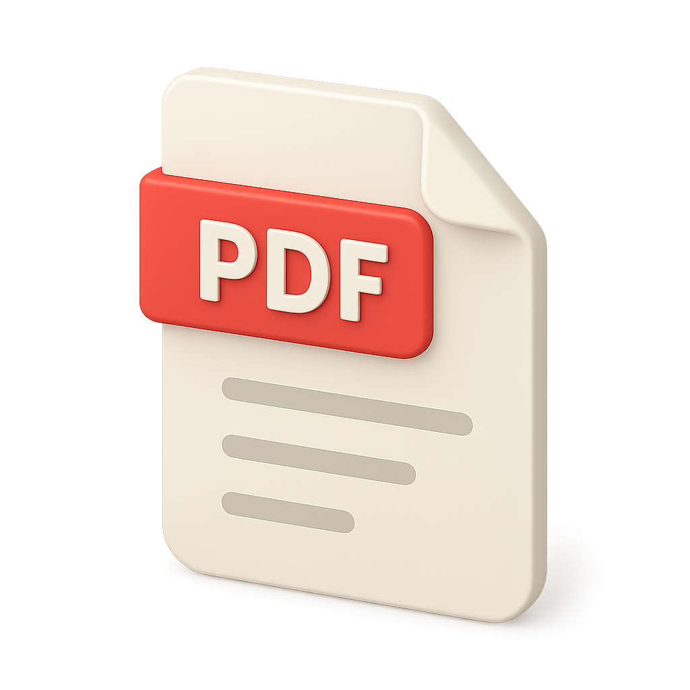

# Papery

> 在浏览器中私密地把照片和图片整理成一份清晰的 PDF。

[English](README.md) | [简体中文](README.zh-CN.md)

**在线使用：[https://pdf.richology.cn/](https://pdf.richology.cn/)**

Papery 是一个免费、轻量的图片转 PDF 工具。你可以添加多张图片、调整页面顺序、旋转图片，再导出一份整洁的 PDF。整个过程不需要把文件上传到服务器。

<p align="center">
  
  &nbsp;&nbsp;
  
  &nbsp;&nbsp;
  
</p>

## 我为什么做 Papery

有一次，我想把几份纸质合同整理成一个 PDF 文件。当时手边只有手机，最直接的办法就是把合同逐页拍下来，但很快遇到了两个问题：

1. 手机拍照通常保存为 JPG、PNG 等图片格式。拍完后得到的是一组零散照片，没办法直接变成一份便于发送、审阅和归档的连续 PDF。
2. 很多 PDF 制作工具需要付费，或者要求注册、添加水印，甚至要先把合同这类敏感文件上传到服务器。

我想要的其实很简单：打开一个网页，选中照片，排好顺序，然后下载一份 PDF。于是，我做了 Papery。

## 它适合哪些场景

只要你需要把多张图片整理成一份便于分享的文档，Papery 都可以派上用场：

- **合同与签字文件**：逐页拍下纸质材料，再按正确顺序合成一份 PDF。
- **发票与报销凭证**：把餐饮、差旅和购物票据统一整理成一个报销文件。
- **课堂笔记与学习资料**：将笔记本、讲义和白板照片汇总成一份文档。
- **表格与申请材料**：把拍摄的表格、证件材料和附件打包后提交。
- **作品集与现场报告**：整理草图、巡检照片、施工或调研记录。
- **个人资料归档**：保存书信、证书、菜谱或家庭资料，更方便长期存储和分享。

## 功能

- 通过文件选择或拖放一次添加多张图片
- 拖动缩略图调整 PDF 页面顺序
- 导出前旋转或删除单张图片
- 支持 A4、Letter 和原图尺寸
- 调整图片质量，平衡清晰度与文件大小
- 可选添加页码
- 最多处理 200 张图片，并自动缩小尺寸过大的图片
- 直接在浏览器中生成并下载 PDF
- 网页界面支持中英文切换

## 隐私优先

你的文件始终留在自己的设备上。图片处理和 PDF 生成都在本地浏览器中完成，Papery 不会把你的合同、票据、笔记或照片上传到服务器。

这也意味着处理速度和内存占用取决于你的设备，尤其是在处理大量高清照片时。

## 使用方法

1. 打开 [Papery](https://pdf.richology.cn/)。
2. 选择图片，或把图片拖入页面。
3. 在预览区调整顺序、旋转图片或删除不需要的页面。
4. 选择页面尺寸、图片质量和是否显示页码。
5. 点击“导出 PDF”，下载整理好的文件。

## 安装与运行

Papery 是一个不需要构建步骤的静态网页应用。

### 使用编程 Agent

把仓库地址发给 Codex、Claude Code 或你正在使用的其他编程 Agent，让它克隆并运行项目：

```text
请克隆并在本地运行这个项目：https://github.com/Richology/image-pdf
```

### 使用命令行

克隆仓库后，使用任意本地 HTTP 服务启动即可：

```bash
git clone https://github.com/Richology/image-pdf.git
cd image-pdf
python3 -m http.server 8000
```

然后在浏览器中打开 `http://localhost:8000`。

## 技术实现

- HTML、CSS 和原生 JavaScript
- 使用 [jsPDF](https://github.com/parallax/jsPDF) 生成 PDF
- 使用 [SortableJS](https://github.com/SortableJS/Sortable) 实现拖拽排序

## 参与贡献

欢迎贡献代码。如果你有新想法、发现了问题，或希望改进无障碍体验、翻译和操作流程，欢迎提交 Issue 或 Pull Request。

提交 Pull Request 时，请尽量保持改动聚焦，说明它解决的问题，并在现代浏览器中完整测试图片转 PDF 流程。

## 开源许可

Papery 使用 [MIT License](LICENSE) 开源。你可以按照该许可证的条款使用、修改和分发本项目。仓库中包含的第三方库仍遵循各自的许可证。
